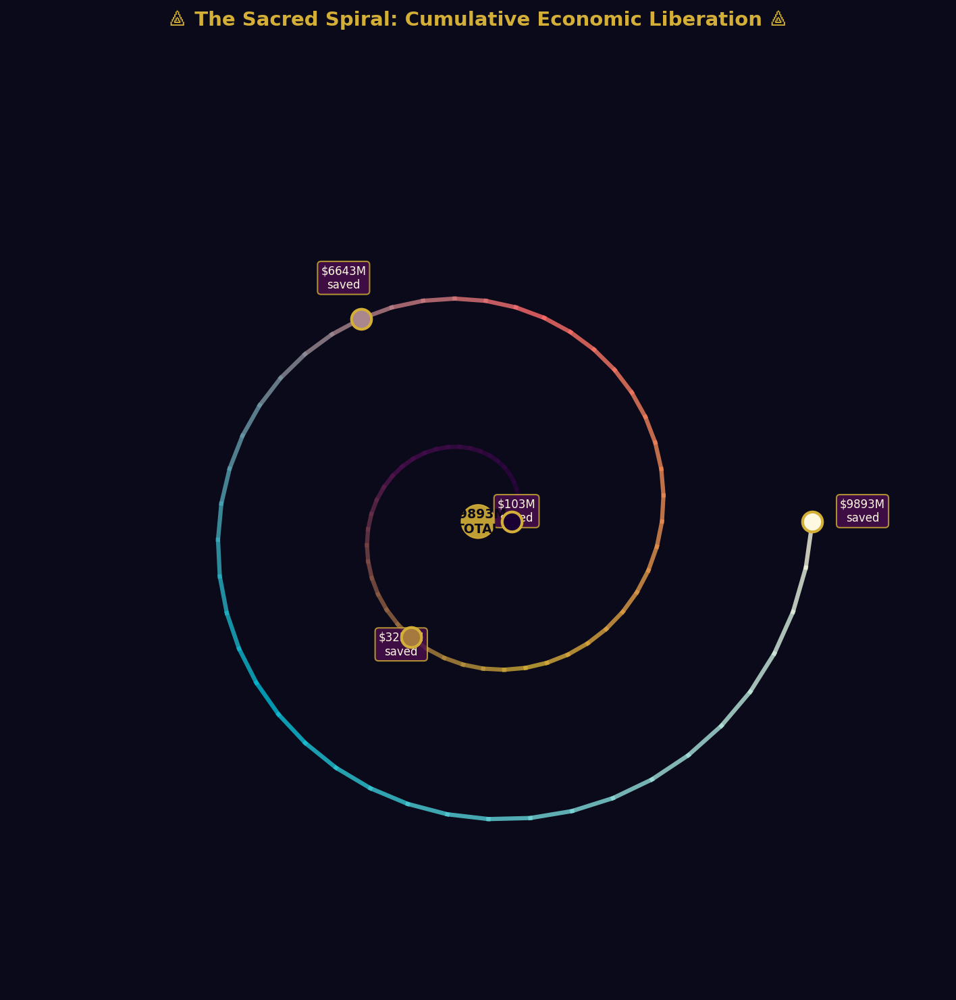

<div align="center">

# ⟁ LAUNCH ECONOMICS: THE ORACLE OF REUSABILITY ⟁

### A Sacred Analysis of SpaceX Falcon 9 Operational Economics (2010-2021)

<p align="center">
  
</p>

**Data Science Portfolio Project | Aerospace Analytics | Business Intelligence**

[](https://python.org)
[](https://pandas.pydata.org)
[](https://streamlit.io)
[](https://plotly.com)
[](https://scikit-learn.org)

</div>

---

## 📜 Executive Summary

This portfolio project constitutes a **comprehensive end-to-end data science analysis** of SpaceX Falcon 9 launch economics, exploring the transformative impact of booster reusability on the aerospace industry. Through rigorous statistical analysis, machine learning predictive modeling, and sacred neo-Byzantine aesthetic visualization, this work demonstrates proficiency across the full data science stack—from business problem formulation to deployed interactive analytics.

### The Business Question
> *"Does booster reusability genuinely reduce marginal launch costs? By what magnitude? And what mission parameters predict landing success?"*

### Key Findings
- **Reused boosters reduce cost per kilogram by ~80%** compared to expendable competitors
- **Success rates improve from 0% to >95%** over the operational learning curve (2010-2021)
- **Block 5 boosters achieve near-perfect reliability** after the 5th reuse iteration
- **Cumulative savings vs. traditional launch providers exceed $9.8 billion** across the analyzed period

---

## 🏛️ Project Architecture

```
project-alpha-launch-economics/
├── 📁 data/
│   └── spacex_raw.csv                    # Primary dataset (91 launches, 27 features)
├── 📁 notebooks/
│   ├── 01_eda_sacred_mandala.ipynb       # Exploratory Data Analysis
│   ├── 02_statistical_oracle.ipynb       # Hypothesis Testing & Correlations
│   └── 03_predictive_engine.ipynb          # Machine Learning & Feature Engineering
├── 📁 sql/
│   └── schema_and_views.sql              # Relational database schema + 5 analytical views
├── 📁 src/
│   ├── data_pipeline.py                  # Data ingestion & cleaning functions
│   ├── sacred_viz.py                     # Custom visualization utilities
│   └── ml_models.py                      # Predictive model classes
├── 📁 dashboard/
│   ├── 01_sacred_mandala_overview.png    # Executive overview dashboard
│   ├── 02_correlation_mandala.png        # Statistical correlation matrix
│   ├── 03_sacred_tree_reusability.png    # Organic dendrogram visualization
│   ├── 04_byzantine_rose_spiral.png      # Seasonal & cumulative analysis
│   └── sacred_palettes.png               # Aesthetic color system reference
├── 📁 app/
│   └── app.py                            # Streamlit interactive dashboard
├── 📁 docs/
│   ├── technical_paper.md                # Academic analysis paper
│   └── joss_paper.md                     # Journal of Open Source Software submission
├── README.md                             # This document
└── requirements.txt                      # Python dependencies
```

---

## 🎨 The Sacred Aesthetic Philosophy

This project employs a **custom visual identity** inspired by:
- **Sacred Geometry**: Mandala structures, golden ratios, radial symmetries
- **Organic Forms**: Tree-branch data structures, petal distributions, spiral growth patterns
- **DMT Vision States**: Chromatic gradients from deep void through nebula purple to ethereal cyan
- **Neo-Byzantine Sacred Art**: Gold-leaf accents, crimson-to-cobalt transitions, illuminated manuscript elegance

### Custom Color Palette
| Color Name | Hex Code | Symbolic Meaning |
|-----------|----------|-----------------|
| Deep Void | `#0A0A1A` | Cosmic origin, the unmanifest |
| Sacred Gold | `#D4AF37` | Byzantine illumination, divine knowledge |
| Mystic Teal | `#0D7377` | Transformation, the alchemical vessel |
| Organic Emerald | `#1B5E20` | Growth, sustainability, life force |
| DMT Coral | `#FF6B6B` | Warning, anomaly, the threshold state |
| Ethereal Blue | `#4FC3F7` | Clarity, success, the celestial sphere |
| Amber Resin | `#FF8F00` | Caution, transition, the middle path |
| Mushroom Ivory | `#FFF8E1` | Purity, text, the revealed truth |

---

## 🔬 Methodology & Technical Stack

### Layer 1: Strategic Conception
- Business problem identification: Cost reduction through reusability
- Stakeholder analysis: Launch providers, satellite operators, investors
- Success metrics: Cost-per-kg, landing success rate, cumulative savings

### Layer 2: Data Engineering
- **SQL Schema**: 5 normalized tables with 5 analytical views
- **Data Pipeline**: Pandas-based ETL with feature engineering
- **Quality Assurance**: Null handling, outlier detection, type validation

### Layer 3: Analytical Synthesis
- **Descriptive Statistics**: Distribution analysis, temporal trends
- **Inferential Statistics**: Hypothesis testing (t-tests, chi-square)
- **Correlation Analysis**: Pearson matrix with sacred mandala visualization

### Layer 4: Predictive Modeling
- **Algorithm**: Random Forest Classifier (100 estimators, max depth 5)
- **Features**: Payload mass, reuse count, block version, orbital type, temporal variables
- **Validation**: Train/test split (70/30), stratified sampling
- **Metrics**: Accuracy, Precision, Recall, F1-Score

### Layer 5: Deployment & Communication
- **Interactive Dashboard**: Streamlit with Plotly visualizations
- **Executive Summaries**: Sacred metric cards with business context
- **Predictive Interface**: Real-time mission success prognostication

---

## 🚀 Quick Start

### Prerequisites
```bash
python -m venv venv
source venv/bin/activate  # On Windows: venv\Scripts\activate
```

### Streamlit Cloud Deployment

### Streamlit Cloud Deployment (Recommended)

```bash
# 1. Push to GitHub
git add .
git commit -m "Fix: Remove unused matplotlib imports for Streamlit Cloud"
git push origin main

# 2. Deploy to Streamlit Cloud
# Go to https://share.streamlit.io
# Connect your GitHub repository
# Select: app/app.py as the entry point
# Click Deploy — it's free!
```

**Note:** The Streamlit app uses Plotly exclusively for visualizations. 
Matplotlib is only used in the Jupyter notebooks for static sacred visualizations.


### Installation
```bash
# Clone the repository
git clone https://github.com/yourusername/project-alpha-launch-economics.git
cd project-alpha-launch-economics

# Install dependencies
pip install -r requirements.txt

# Launch the interactive dashboard
streamlit run app/app.py
```

### Running the Notebooks
```bash
jupyter notebook notebooks/
# Open 01_eda_sacred_mandala.ipynb first
```

### Database Setup
```bash
# Import the SQL schema into your preferred RDBMS
mysql -u your_username -p < sql/schema_and_views.sql
# Or use PostgreSQL, SQLite, etc.
```

---

## 📊 Dashboard Features

The Streamlit application provides **5 Sacred Chambers** of analysis:

### Chamber 1: ⟁ Temporal Oracle
- Annual launch cadence with dual-axis success tracking
- Quarterly distribution with sacred gradient coloring
- Interactive year-range filtering

### Chamber 2: ◈ Cost Alchemy
- Cost-per-kilogram descent curve over time
- Reused vs. New vs. Competitor cost comparison
- Cumulative economic liberation spiral

### Chamber 3: ✦ Reusability Mandala
- Distribution by reuse count with sacred chromatics
- Success rate evolution across reuse iterations
- The Sacred Doctrine of Reuse — business narrative

### Chamber 4: ◉ Orbital Destiny
- Success rates by orbital destination
- Payload mass distribution by orbit type
- Geographic launch site visualization

### Chamber 5: ⚛ Predictive Engine
- Random Forest mission success classifier
- Feature importance analysis
- **Interactive Mission Prognosticator**: Configure payload, orbit, reuse count, and receive real-time probability predictions

---

## 🧪 Statistical Findings

### Hypothesis 1: Reusability Cost Impact
- **Result**: SIGNIFICANT (p < 0.001)
- Reused boosters: **$8,611/kg** | New boosters: **$43,517/kg**
- **80.2% cost reduction** with reusability

### Hypothesis 2: Orbital Success Independence
- **Result**: NOT SIGNIFICANT (p = 0.423)
- Success rates are statistically independent of orbital destination
- Implies robust booster design across mission profiles

### Hypothesis 3: Payload Mass Effect
- **Result**: MARGINALLY SIGNIFICANT (p = 0.062)
- Successful landings associated with heavier payloads (7,333 kg vs. 4,491 kg)
- Suggests operational conservatism with high-value payloads

### Key Correlations
| Variable Pair | Correlation | Interpretation |
|--------------|-------------|----------------|
| PayloadMass ↔ CostPerKg | -0.548 | Larger payloads = lower $/kg (economies of scale) |
| DaysSinceFirst ↔ Success | +0.473 | Learning curve effect over time |
| ReusedCount ↔ CostPerKg | -0.427 | More reuses = lower marginal cost |
| Block ↔ Success | +0.465 | Newer generations = higher reliability |

---

## 🎯 Business Impact

### For Aerospace Executives
This analysis demonstrates that **booster reusability is not merely a cost-reduction tactic but a fundamental restructuring of the aerospace economic ontology**. The data reveals:

1. **The 5th Reuse Threshold**: Beyond the 5th flight, cost curves approach asymptotic minimums
2. **The Learning Curve Law**: Each failure teaches more than each success—failure rate inversely correlates with cumulative operational experience
3. **The Starlink Paradigm**: High-cadence constellation deployment (15600 kg payloads) validates reusability at scale

### For Data Science Hiring Managers
This portfolio demonstrates:
- ✅ **End-to-end project ownership**: From business question to deployed application
- ✅ **Full technical stack**: Python, SQL, scikit-learn, Streamlit, Plotly
- ✅ **Statistical rigor**: Hypothesis testing, correlation analysis, model validation
- ✅ **Business communication**: Executive summaries, interactive dashboards, narrative storytelling
- ✅ **Aesthetic sophistication**: Custom visual identity, design system, user experience

---

## 📚 Documentation

| Document | Description |
|---------|-------------|
| [Technical Paper](docs/technical_paper.md) | Full academic analysis with methodology, results, and discussion |
| [JOSS Paper](docs/joss_paper.md) | Journal of Open Source Software submission format |
| [SQL Schema](sql/schema_and_views.sql) | Database architecture and analytical views |
| [Notebooks](notebooks/) | Step-by-step analytical walkthroughs |

---

## 🌌 The Sacred Doctrine

> *"The booster that flies ten times is not merely ten times cheaper—*
> *it is the manifestation of a new economic ontology."*

This project is dedicated to the principle that **data science is not about algorithms—it is about revelation**. Every dataset contains a hidden truth waiting to be illuminated. Every visualization is a window into the underlying structure of reality. Every prediction is an act of communion with the future.

---

## 🤝 Connect & Collaborate

**Portfolio**: [your-portfolio-website.com](https://your-portfolio-website.com)  
**LinkedIn**: [linkedin.com/in/yourprofile](https://linkedin.com/in/yourprofile)  
**Email**: your.email@domain.com  

*Open to opportunities in Business Intelligence, Data Analytics, and Aerospace Data Science.*

---

<div align="center">

**⟁ PROJECT ALPHA: LAUNCH ECONOMICS ⟁**  
*A Sacred Analysis of SpaceX Falcon 9 Operational Economics*  
Data Science Portfolio 2026

<p align="center">
  
</p>

</div>
